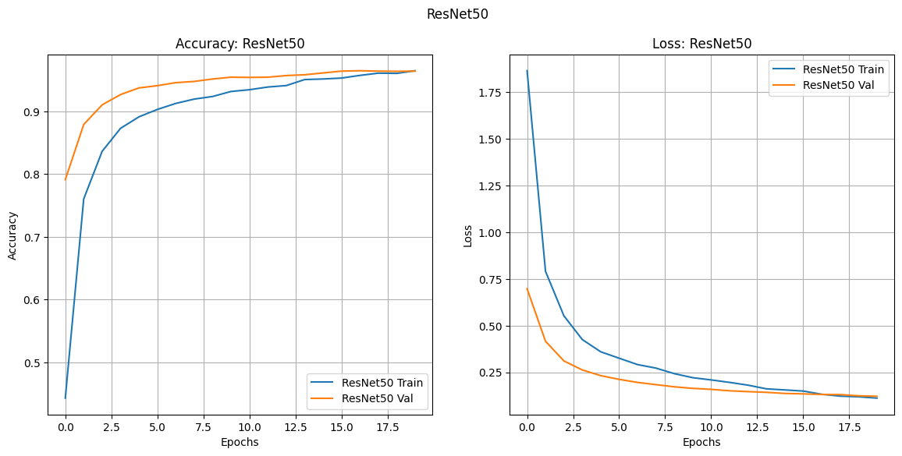
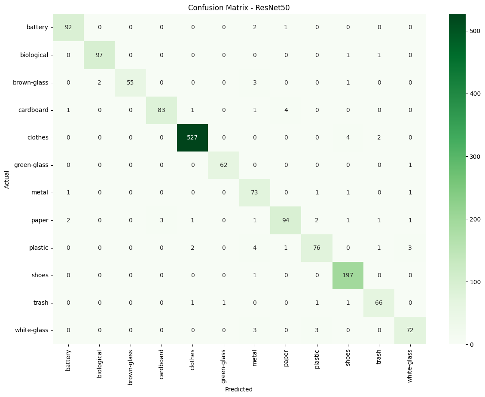

# 🧠 DeepLearning_VGG16_ResNet50_GarbageClassification
## End-to-End **Residual Network (ResNet)** Implementation for Automated Waste Classification

[](https://www.python.org/)
[](https://www.tensorflow.org/)
[](https://streamlit.io/)

---

### 📝 Project Executive Summary

This project delivers a robust **Computer Vision** solution for the high-accuracy classification of 12 waste categories. The work emphasizes **ML Engineering (MLOps) principles** through a rigorous **Architectural Comparative Study** and the creation of an integrated deployment service.

The **ResNet-50** architecture demonstrated superior performance, validated by its capacity to leverage **identity shortcut connections** to mitigate the vanishing gradient problem in deep layers. The finalized ResNet-50 model is served as a *low-latency* inference API using Streamlit.

### 🎯 Key Performance Indicators (KPIs)

The evaluation was conducted on an independent test set to validate generalization capability.

| Architecture | Transfer Learning Technique | Test Accuracy | Weighted F1-Score | Status |
| :--- | :--- | :--- | :--- | :--- |
| **VGG16** | Fine-Tuning ImageNet | 95.0% | 0.95 | Baseline |
| **ResNet-50** | Fine-Tuning ImageNet | **96.0%** | **0.96** | **Production Candidate** |

---

### 🔬 Technical Methodology: Fine-Tuning & Optimization

The entire experimentation pipeline is documented in **`main_model.ipynb`**.

#### A. Advanced Transfer Learning Strategy

* **Base Models:** VGG16 and ResNet-50 were initialized with **ImageNet weights**.
* **Architecture Rationale:** ResNet-50 was favored due to its residual blocks, enabling the training of deeper networks with stable gradients. 
* **Custom Head:** The base convolutional layers were frozen, and a custom classification head was attached, utilizing a **Global Average Pooling (GAP)** layer followed by two **Dense** layers (culminating in the 12-class Softmax output).
* **Optimization Strategy:** Training employed the **Adam Optimizer** with a strategic learning rate decay and the **Categorical Crossentropy** loss function, appropriate for multi-class classification.
* **Data Augmentation:** **`tf.keras.preprocessing.image.ImageDataGenerator`** was utilized for on-the-fly transformations (rotations, shear, flips) to enhance model robustness and reduce reliance on synthetic data.

#### B. Performance Analysis and Error Attribution

#### Training Convergence (ResNet-50)
* **Analysis:** The Training and Validation Loss curves converge closely and smoothly, confirming **effective regularization** and successful prevention of severe *overfitting*. The stability of these curves demonstrates the resilience of the ResNet architecture during deep training.



#### Class-Specific Confusion Matrix (ResNet-50)
* **Insight:** The matrix shows high diagonal values. Error analysis indicates common confusion between visually similar classes (e.g., *Paper/Cardboard* and *different colors of Glass*), which are difficult even for human sorting. This pinpoints areas for potential future model improvements (e.g., integrating attention mechanisms).



---

### ⚙️ MLOps and Software Engineering Excellence

This repository is architected for deployment consistency, which is crucial for an AI Engineering role.

1.  **Environment Reproducibility (Dev Containers):** The inclusion of the **VS Code Dev Container** configuration (`.devcontainer/`) ensures **100% environment parity**. This crucial step allows any reviewer to launch a fully configured, consistent environment instantly, demonstrating best practices in dependency management.
2.  **Low-Latency Deployment Service (`app.py`):**
    * The ResNet-50 model is encapsulated in a Streamlit web service.
    * **Technical Visualization:** The application uses **Plotly Express** to dynamically display a bar chart of the **Top-5 Prediction Confidence Levels**. This provides detailed technical insight alongside the primary prediction, enhancing the user experience beyond a simple label output.
3.  **Asset Management:** All model checkpoints (`*.keras`) are versioned and managed using **Git Large File Storage (Git LFS)**, maintaining a lightweight core Git repository.

### 🚀 Setup & Execution (Bash Ready)

The following script automates environment setup, dependency installation, and asset fetching.

#### 1. Setup Environment and Fetch Model Assets

```bash
# Execute this script in your project root directory. Requires Git LFS and Python 3.x.
echo "Fetching large model assets via Git LFS and setting up environment..."

# 1. Fetch checkpoints model
git lfs pull

# 2. Create and activate a Python Virtual Environment
python3 -m venv venv
source venv/bin/activate

# 3. Install all dependencies
pip install --upgrade pip
pip install -r requirements.txt

echo "Setup complete. Virtual environment activated. Run step 2."

#### **2. Launch Real-Time Streamlit Application**
